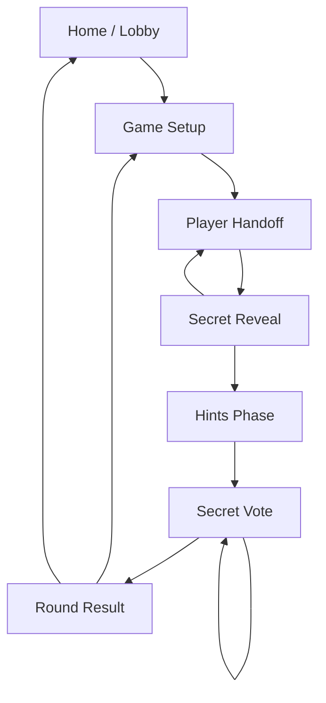

# Imposter Game iOS Wireframes

This document describes the first-pass iOS wireframes for the Imposter Game MVP.
The visual board is available at [ios-wireframes.html](./ios-wireframes.html).

## Design Direction

- Platform: iPhone portrait.
- Style: low-fidelity, dark-first, modern party-game UI.
- Navigation: linear stack, not tabs.
- Primary constraint: one shared phone passes between players.
- MVP behavior: fully playable offline with local/mock round data.

## Screen Flow



## Screens

### 1. Home / Lobby

Purpose: give the group a fast entry point into a round.

Core elements:
- App title and short game premise.
- Last-used setup summary.
- Primary `Start Game` action.
- Secondary `How to Play` action.

Navigation:
- `Start Game` opens setup.
- `How to Play` can be a modal or bottom sheet later.

### 2. Game Setup

Purpose: configure the round with minimal friction.

Core elements:
- Player count stepper.
- Language selector.
- Category selector.
- Difficulty segmented control.
- Imposter clue toggle.
- Primary `Create Round` action.

Implementation notes:
- Keep labels short enough for localization.
- Avoid network dependency in MVP; this should create mock/local round data.

### 3. Player Handoff

Purpose: protect hidden information before reveal.

Core elements:
- Reveal progress.
- Current player callout.
- Privacy note.
- Primary `Show My Word` action.

Implementation notes:
- Disable back navigation during reveal.
- This state appears before every player's secret reveal.

### 4. Secret Reveal

Purpose: show one player their private information.

Core elements:
- Secret word card for regular players.
- Alternate imposter state with optional clue.
- Primary `Done - Pass Phone` action.

Implementation notes:
- Do not show another player's word through back navigation.
- After `Done`, immediately return to a handoff state for the next player.

### 5. Hints Phase

Purpose: guide the group through hint-giving order.

Core elements:
- Current turn card.
- Optional timer display.
- Turn list with done/current/next states.
- Primary `Next Hint` action.

Implementation notes:
- The app does not need to record spoken hints for MVP.
- The flow should be clear enough that the table can run it aloud.

### 6. Secret Vote

Purpose: collect hidden votes from each player.

Core elements:
- Current voter handoff title.
- Candidate list.
- Disabled self-vote state.
- Primary `Lock Vote` action.

Implementation notes:
- After locking each vote, show the next player's handoff state.
- Votes remain hidden until the result screen.

### 7. Round Result

Purpose: reveal the imposter, the secret word, votes, and winner.

Core elements:
- Outcome headline.
- Imposter identity.
- Secret word.
- Vote summary bars.
- `Play Again` and `Back Home` actions.

Implementation notes:
- `Play Again` should preserve settings and generate a new mock/local round.
- `Back Home` clears active round state.

## Expo Router Mapping

Recommended route structure:

```text
imposter-game/app/
  _layout.tsx
  index.tsx
  setup.tsx
  reveal/
    [playerIndex].tsx
  hints.tsx
  vote.tsx
  result.tsx
```

## Key Interaction Rules

- Reveal and vote phases use handoff states so the right player has the phone.
- Reveal back navigation is disabled.
- Every player receives exactly one private reveal per round.
- Exactly one player is the imposter.
- Regular players receive the same secret word.
- The imposter receives either no word or a vague clue, depending on setup.
- Voting is secret until results.

## Open Product Decisions

- Whether player names are custom names or simple `Player 1`, `Player 2`, etc. for MVP.
- Whether the hint timer is required or optional.
- Whether the imposter clue toggle ships in MVP or defaults to one behavior.
- Whether ties in voting favor the imposter or trigger a revote.
